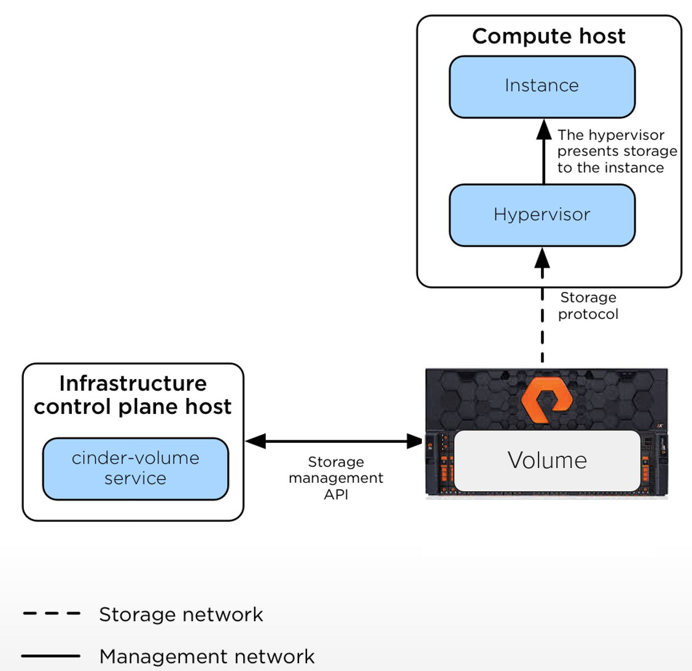

Overview
========

The OpenStack Block Storage service provides management of persistent
block storage resources. In addition to acting as secondarily attached
persistent storage, you can write images into a Cinder volume for Nova
to utilize as a bootable, persistent root volume for an instance. The
Block Storage service was originally a component within Nova called
``nova-volume``, but emerged as an official, independent project in the
Folsom release. Cinder is conceptually similar in function to the
well-known Amazon Elastic Block Storage (EBS) offering.

Cinder is typically deployed in conjunction with other OpenStack
services (e.g. Compute, Object Storage, Image, etc) as part of a larger,
more comprehensive cloud infrastructure. This is not an explicit
requirement, as Cinder has been successfully deployed as a standalone
solution for block storage provisioning and lifecycle management.

.. tip::

   As a management service, Cinder controls the provisioning and
   lifecycle management of block storage volumes. It does not reside in
   the I/O (data) path between the hypervisor and the storage
   controller, as depicted in Figure 4.1 below.

   Figure 4.1. Cinder and Nova Logical Architecture
