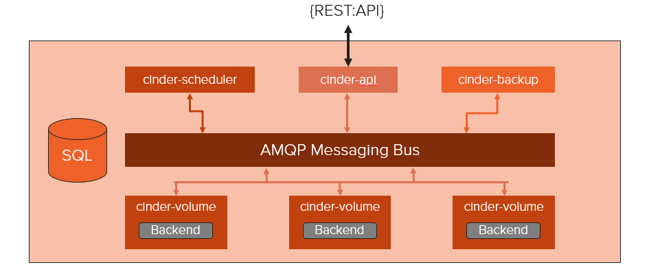
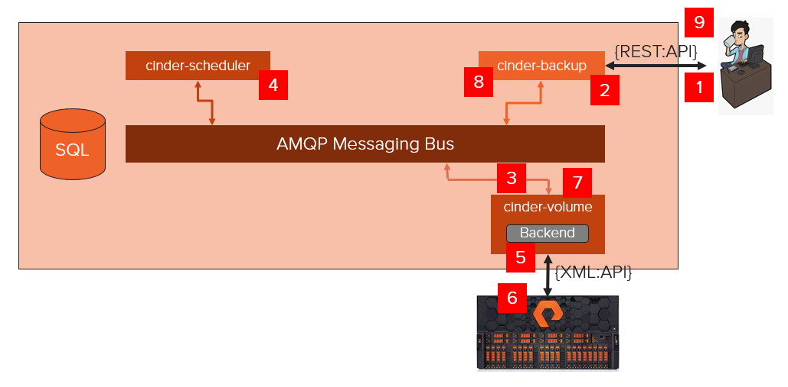
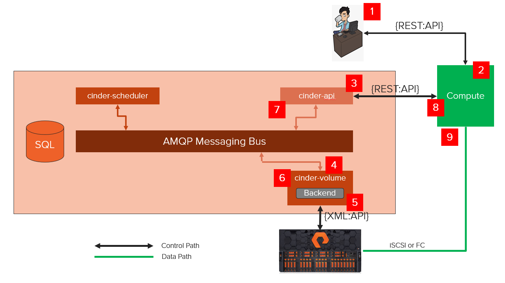
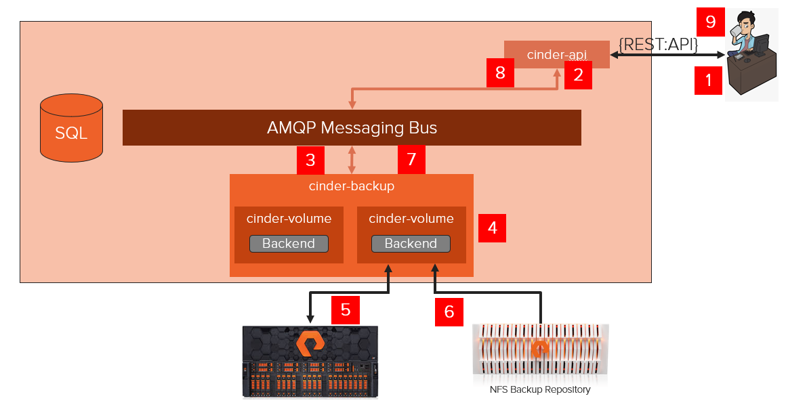

Process Structure
=================

There are four processes that make up the Cinder service:

-  ``cinder-api`` is an WSGI application that accepts and validates REST
   (JSON or XML) requests from clients and routes them to other Cinder
   processes as appropriate over AMQP.

-  ``cinder-scheduler`` determines which backend should serve as the
   destination for a volume creation or movement request. It maintains
   non-persistent state for backends (e.g. available capacity,
   capabilities, and supported extra specs) that can be leveraged when
   making placement decisions. The algorithm utilized by the scheduler
   can be changed through Cinder configuration.

-  ``cinder-volume`` accepts requests from other Cinder processes and
   serves as the operational container for Cinder drivers. This process
   is multi-threaded and typically has one thread of execution per
   Cinder backend as defined in the Cinder configuration file.

-  ``cinder-backup`` handles the interaction with potential backup
   targets (e.g. a file store exported via NFS or an OpenStack Object
   Storage Service (Swift)) when a client requests a volume backup or
   restore operation.

   Figure 4.2. Cinder Processes Concept Diagram

Volume Creation Workflow
------------------------

The following section walks through the steps that occur when a user
requests the creation of a new volume from Cinder.

   Figure 4.3. Cinder Workflow - Volume Creation

1. Client issues request to create volume through invoking REST API
   (client may use ``python-cinderclient`` CLI utility).

2. ``cinder-api`` process validates request, user credentials; once
   validated, puts message onto AMQP queue for processing.

3. ``cinder-volume`` process takes message off of queue, sends message
   to cinder-scheduler to determine which backend to provision volume
   into.

4. ``cinder-scheduler`` process takes message off of queue, generates
   candidate list based on current state and requested volume criteria
   (size, availability zone, volume type (including extra specs)).

5. ``cinder-volume`` process reads response message from
   ``cinder-scheduler`` from queue; iterates through candidate list by
   invoking backend driver methods until successful.

6. FlashArray Cinder driver creates requested volume through interactions
   with storage subsystem (dependent on configuration and protocol).

7. ``cinder-volume`` process collects volume metadata and connection
   information and posts response message to AMQP queue.

8. ``cinder-api`` process reads response message from queue and responds
   to client.

9. Client receives information including status of creation request,
   volume UUID, etc.

Volume Attach Workflow
----------------------

The following section walks through the steps that occur when a user
requests that a Cinder volume be attached to a Nova compute instance.

   Figure 4.4. Cinder & Nova Workflow - Volume Attach

1. Client issues request to attach volume through invoking Nova REST API
   (client may use ``python-novaclient`` CLI utility).

2. ``nova-api`` process validates request, user credentials; once
   validated, invokes Cinder API to get connection information for
   specified volume.

3. ``cinder-api`` process validates request, user credentials; once
   validated, posts message to volume manager over AMQP.

4. ``cinder-volume`` reads message from queue, invokes Cinder driver
   corresponding to volume to be attached.

5. FlashArray Cinder driver prepares Cinder volume in preparation for
   attachment (specific steps dependent on storage protocol used).

6. ``cinder-volume`` process posts response information to
   ``cinder-api`` process via AMQP queue.

7. ``cinder-api`` process reads response message from ``cinder-volume``
   from queue; passes connection information in RESTful response to Nova
   caller.

8. Nova creates the connection to the storage with the returned
   information from Cinder.

9. Nova passes the volume device/file to the hypervisor, who then
   attaches the volume device/file to the guest VM as an actual or
   virtualized block device (dependent on storage protocol).

Volume Backup Workflow
----------------------

The following section walks through the steps that occur when a user
requests that a Cinder volume be backed up.

   Figure 4.5. Cinder Backup Workflow

1. Client issues request to backup a Cinder volume by invoking REST API
   (client may use ``python-cinderclient`` CLI utility).

2. ``cinder-api`` process validates request, user credentials; once
   validated, posts message to backup manager over AMQP.

3. ``cinder-backup`` reads message from queue, creates a database record
   for the backup and fetches information from the database for the
   volume to be backed up.

4. ``cinder-backup`` invokes the ``backup_volume`` method of the Cinder
   volume driver corresponding to volume to be backed up, passing the
   backup record and the connection for the backup service to be used
   (NFS, Swift, etc.)

5. The appropriate Cinder volume driver attaches to the source Cinder
   volume.

6. The volume driver invokes the ``backup`` method for the configured
   backup service, handing off the volume attachment.

7. The backup service transfers the Cinder volume's data and metadata to
   the backup repository.

8. The backup service updates the database with the completed record for
   this backup and posts response information to ``cinder-api`` process
   via AMQP queue.

9. ``cinder-api`` process reads response message from queue and passes
   results in RESTful response to the client.

Volume Restore Workflow
-----------------------

The following section walks through the steps that occur when a user
requests that a Cinder backup be restored.

   Figure 4.6. Cinder Restore Workflow

1. Client issues request to restore a Cinder volume by invoking REST API
   (client may use ``python-cinderclient`` CLI utility).

2. ``cinder-api`` process validates request, user credentials; once
   validated, posts message to backup manager over AMQP.

3. ``cinder-backup`` reads message from queue, fetches the database
   record for the backup and a new or preexisting volume database
   record, depending on whether a preexisting volume was requested or
   not.

4. ``cinder-backup`` invokes the ``backup_restore`` method of the Cinder
   volume driver corresponding to volume to be backed up, passing the
   backup record and the connection for the backup service to be used
   (NFS, Swift, etc.)

5. The appropriate Cinder volume driver attaches to the destination
   Cinder volume.

6. The volume driver invokes the ``restore`` method for the configured
   backup service, handing off the volume attachment.

7. The backup service locates the backup metadata and data for the
   Cinder volume in the backup repository and uses these to restore the
   destination Cinder volume to a state matching the source volume for
   the original backup operation at the time of that operation.

8. The backup service posts response information to ``cinder-api``
   process via AMQP queue.

9. ``cinder-api`` process reads response message from ``cinder-backup``
   from queue and passes results in RESTful response to the client.
