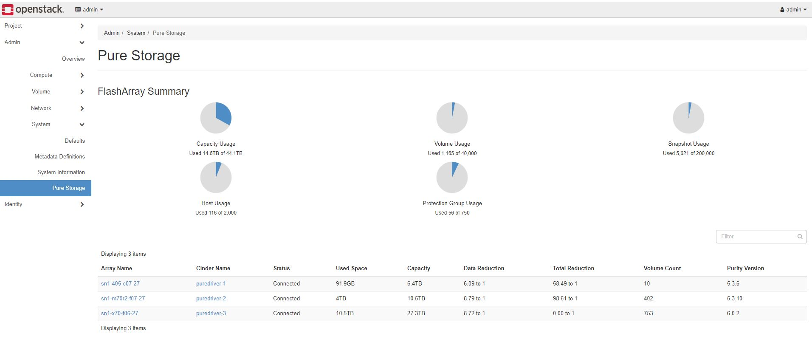
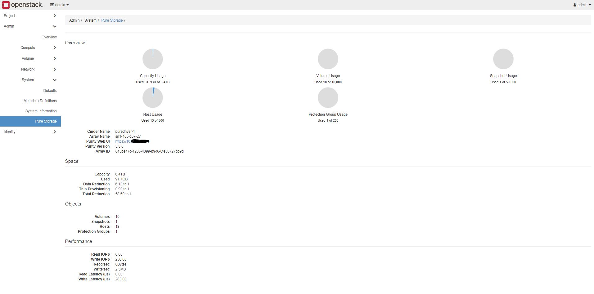
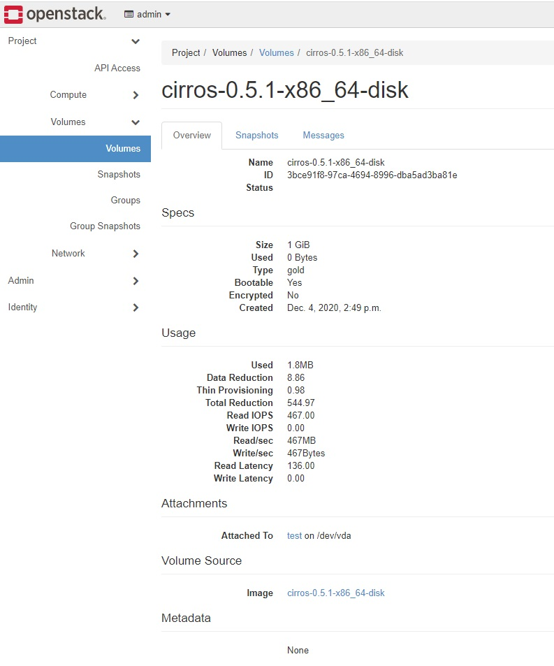

Pure Storage Horizon Plugin
---------------------------

The Pure Storage OpenStack Dashboard plugin adds deeper integration for
Pure Storage FlashArrays configured in the Cinder project. It includes:

* A new Admin panel that shows configured Arrays and their current states.
* Overriden volume detail views (Admin and Project) which shows additional
  volume usage and performance information.

Requirements
------------

There is a dependency on the ``purestorage`` python module which is used for
querying the FlashArray's REST API. This requirements should already be
met due to the implementation of the Pure Storage FlashArray Cinder
driver in a deployment. Other than that you just need a working
Horizon installation.

Installation
------------

Install and configure Horizon in your OpenStack deployment.

Install the Pure Storage Horizon plugin package with following commands::

  git clone https://github.com/PureStorage-OpenConnect/horizon-pure-ui.git
  cd horizon-pure-ui
  sudo pip install .

If Horizon was installed to run with a virtual environment you may need to
install using a different pip command, for example::

  $HORIZON_DIR/tools/with_venv.sh pip install

As long as the ``horizon_pure`` module is available in the PYTHON_PATH for
Horizon you should be all set.

Copy the panel configuration and enabled file::

  cp -rv ./horizon_pure/enabled $HORIZON_DIR/openstack_dashboard/local/
  cp -v ./horizon_pure/local_settings.d/_9999_pure_settings.py.example \
       $HORIZON_DIR/openstack_dashboard/local/local_settings.d/_9999_pure_settings.py

Configuration
-------------

To configure the plugin modify ``$HORIZON_DIR/openstack_dashboard/local/local_settings.d/_9999_pure_settings.py``
to add your Cinder enabled FlashArrays. The example configuration should look something
like::

    PURE_FLASH_ARRAYS = [
        {
            # Virtual IP address or FQDN for Flash Array
            'san_ip': '10.231.128.11',

            # API Token for Flash Array
            'api_token': '661f9687-0b1e-7b0d-e07d-1e776d50f9eb',

            # The backend name for the Flash Array, typically this is the value
            # set in the "enabled_backends" section of cinder.conf
            'backend_name': 'pure-iscsi',
        },
        # Repeat for additional arrays
    ]

The basic idea is that for each Cinder backend Pure Storage FlashArray you
provide a mapping and credential information.

.. note::

    An automated process for performing this is in development.

The parameters are as follows:

**san_ip**
  Same as the ``san_ip`` in the Cinder Volume Driver configuration. It will
  be the virtual IP or FQDN for the Purity management interface. It must be
  accessible by the Horizon controllers.

**api_token**
  Same as the ``api_token`` in the Cinder Volume Driver configuration.
  This needs to be a valid REST API token to issues requests to the Array.

**backend_name**
  This should be the same as the Volume Service configured backend name. It
  will match the value set in ``enabled_backends``.

To better understand the naming, look at the output of ``cinder service-list``::

  +------------------+---------------------+------+---------+-------+----------------------------+-----------------+
  | Binary           | Host                | Zone | Status  | State | Updated_at                 | Disabled Reason |
  +------------------+---------------------+------+---------+-------+----------------------------+-----------------+
  | cinder-scheduler | devstack            | nova | enabled | up    | 2016-10-12T20:30:25.000000 | -               |
  | cinder-volume    | devstack@pure-iscsi | nova | enabled | up    | 2016-10-12T20:30:28.000000 | -               |
  +------------------+---------------------+------+---------+-------+----------------------------+-----------------+
  
The "Host" column for the cinder-volume binaries has the ``cinder_host`` and
``backend_name`` in the format of ``cinder_host@backend_name``

You may repeat these configuration dictionaries for as many backends as needed.

Restart Horizon GUI
-------------------

After any changes to the configuration file, it is necessary to restart the `httpd` service provided by OpenStack Horizon.

For example::

  sudo systemctl restart apache2

Using the Pure Horizon GUI
--------------------------

After installing the GUI plugin and restarting your httpd service, you can access the new Pure related information in two ways:

1. As an Administrator by navigating to **Admin** -> **System** -> **Pure Storage** where you will see a panel similar to this:

   Figure 10.1. FlashArray Summary Dashboard
    
* Selecting the ``Array Name`` will open a new browser window to the FlashArray Logon GUI.

* Selecting the ``Cinder Name`` filed will give a more detailed view of that specific backend array, such as:

   Figure 10.1. FlashArray Detail Dashboard

2. As a user from the Project level by navigating to **Project** -> **Volumes** -> **Volumes** and then selecting one of the volumes
   provided by a Pure Storage Cinder driver. This will give an enhanced view of the volume with additional **Usage** information.
   An example of this is:

   Figure 10.3. Enhanced Volume Dashboard

Uninstalling
------------

To uninstall the Pure Horizon GUI run::

  sudo pip uninstall horizon-pure

and delete the enabled and settings files::

  rm $HORIZON_DIR/openstack_dashboard/local/enabled/_9999_pure_panel.py
  rm $HORIZON_DIR/openstack_dashboard/local/local_settings.d/_9999_pure_settings.py

Compatibility
-------------

This has been tested with DevStack on master and Victoria branches. Anything else
your mileage may vary.

.. warning::

    This plugin **WILL NOT** work with OpenStack Stein or earlier versions due
    to Django versioning changes.

Known Issues
------------

* An array running Purity//FA 6.0.x will show Total Reduction as "0.00 to 1" if
  FA-Files is enabled on the array.
* Using the same array in different cinder stanzas will confuse the calculations and
  the array will be double counted

Support
-------

Please file bugs and issues at the Github issues page. The code and
documentation are released with no warranties or SLAs and are intended to be
supported through a community driven process.
