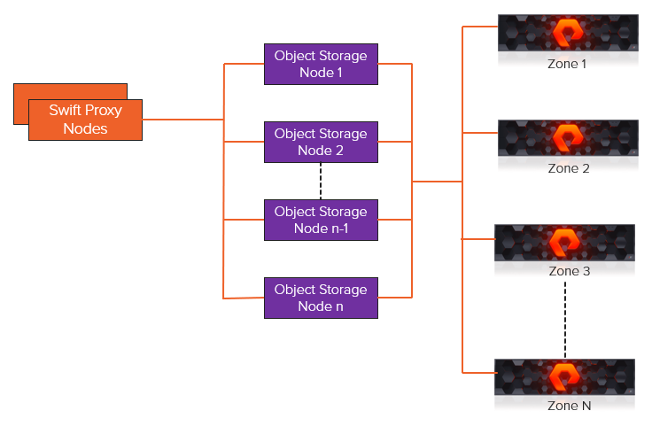

Swift Zones and Pure Storage FlashArray
=======================================

Swift uses zoning to isolate the cluster into separate partitions to
isolate the cluster from failures. Swift data is replicated across the
cluster in zones that are as unique as possible. A zone is an arbitrary
grouping of nodes; typically zones are established that use physical
attributes of the cluster, such as geographical locations, separate
networks, equipment racks, storage subsystems, or even single drives.
Zoning allows the cluster to tolerate equipment failures within the
cluster without data loss or loss of connectivity to the remaining
cluster.

By default, Swift replicates data 3 times across the cluster. Swift
replicates data across zones in a unique pattern that attempts to ensure
high availability and high durability for data. Swift chooses to place a
replica of data in a server in an unused zone before placing it into an
unused server in a zone that already has a replica of the data.

The inherent data integrity features built into FlashArrays ensures that clients always
have access to their data - regardless of drive or other component
failures within the storage subsystem. When FlashArray storage is used
Swift data replication counts specified when rings are built can be
reduced from 3 to 1.

Controller-subsystem Based Zoning
---------------------------------

In a cluster that contains several FlashArray systems zoning
may be done through the use of 1 or more FlashArrays as a zone.
An example of this is shown in
Figure 8.2, “Controller-subsystem based zoning”.

   Figure 8.2. Controller-subsystem based zoning
