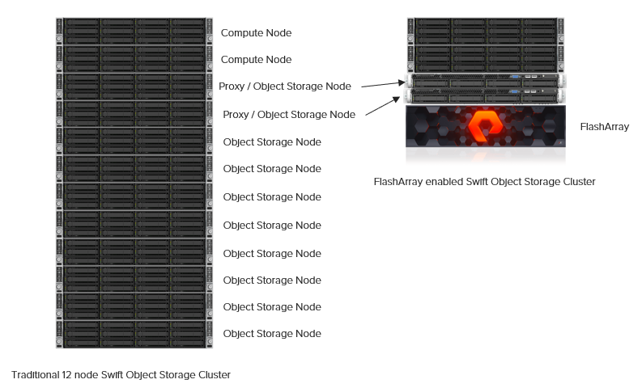

Overview
========

There are several major advantages of using a FlashArray for Swift
object storage nodes. These include:

-  A dramatic reduction in the storage capacity and physical hardware
   required to facilitate data protection through Swift’s consistent
   hashing ring. The FlashArray’s unique parity protection scheme enable 
   it as an alternative to the default approach involving
   creating 3 or more copies of data. Within a single site, the capacity
   required for object storage along with the parity overhead is an
   approximate 1.3 multiple of the object(s) stored. The default Swift
   behavior involves storing a multiple of 3.

-  The reduction of replicas made possible by the use of a FlashArray has the
   effect of significantly reducing a typically major inhibitor to the
   scale a given Swift cluster can achieve. It has been observed that
   the weight of replication traffic can become a limitation to scale in
   certain use cases.

-  The associated storage capacity associated with employing based on the
   global data reduction rate of the FlashArray

-  Reduced Swift node hardware requirements: Internal drive requirements
   for storage nodes are reduced, only operating system storage is
   required. Disk space for Swift object data, and optionally the
   operating system itself, is supplied by the FlashArray.

-  Reduced rack space, power, cooling and footprint requirements: Since
   a single storage subsystem provides storage space for multiple Swift
   nodes, smaller and possibly lower power 1U nodes can be used in the
   cluster.

.. _swift_compare:

   Figure 8.1. Traditional and FlashArray Swift Stack Comparison

On the left of :ref:`swift_compare` is a traditional
Swift cluster, which has a total storage capacity of 240TB. This
requires 10 Swift object storage nodes with 12 2TB drives per system,
which results in approximately 80 TB of effective storage capacity
assuming that Swift uses the default replica count of 3.

Compare this traditional system to the FlasArray based cluster, shown on
the right in :ref:`swift_compare`. The FlashArray is a single 3U system
that, depending on the configuration selected can provide up to 878TB of
raw disk capacity. This number can be effectively  multiplied by the
global data reduction rate achieved by the FlashArray, which is
dependent on the data stored within the Swift environment.
